# Included Materials {#build-materials-included status=ready}

Welcome to your Duckietown Sky Drone kit! This section contains a list of parts and materials included in your kit.

Note: Depending on the hardware version of your drone kit, the components may look different, but the functionality will be the same.

## Your drone kit
<figure>
    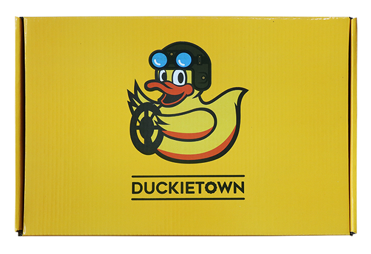
</figure>

## Frame Kit
<figure>
    <figcaption>Drone Frame</figcaption>
    
</figure>

**Units:** 1  
**Description:** Carbon Fiber Quad frame. Components include: Top platform, Bottom Platform, Sandwich Platform, 4 Arms, 4 Landing Gears, 4 Propeller Guards 

### Standoffs 
<figure>
    <figcaption>Standoffs</figcaption>
    
</figure>

**Units:** 4  
**Description:** A special type of screw that can also accept other screws. Used for assembling the frame.

### Screws 

<figure>
    
</figure>  

**Units:** M3 6mm(11)  M3 10mm(18)  M3 12mm(22)  M3 16mm(5)  M2 6mm(5)
**Description:** Small screws that are used for component mounting and frame assembly. 

### Nuts 

<figure>
    
</figure>  

**Units:** M3(50)  M2(5)
**Description:** Small nuts that are used for component mounting and frame assembly. 

## Power Distribution Board (PDB) 
<figure>
    <figcaption>PDB</figcaption>
    
</figure>  

**Units:** 1  
**Description:** An electronic component that distributes power that it receives to other components connected to it. Included in the frame box.

### XT60 Connector 
<figure>
    
</figure>  

**Units:** 1

**Description:** The power connector cable that transfers power from the battery to the PDB.

## 2205 2300KV Brushless Motor 
<figure>
    
</figure>  

**Description:** An actuator that spins at variable speeds. Although brushless motors can spin in either direction, the motor shafts are threaded so that as the propellor spins, it does not loosen the nut and fly off. You can identify which direction a motor should spin by noticing the direction of the arrows on top.

### Clockwise Motor 
<figure>
    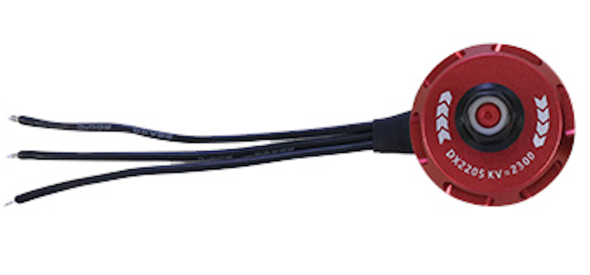
</figure>  

**Units:** 2

### Counter-clockwise Motor 

<figure>
    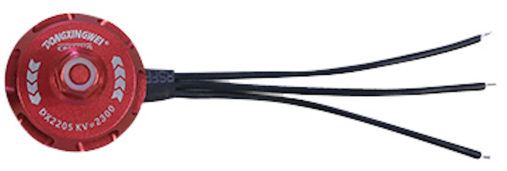
</figure>  

**Units:** 2

### M3 Bolts 
<figure>
    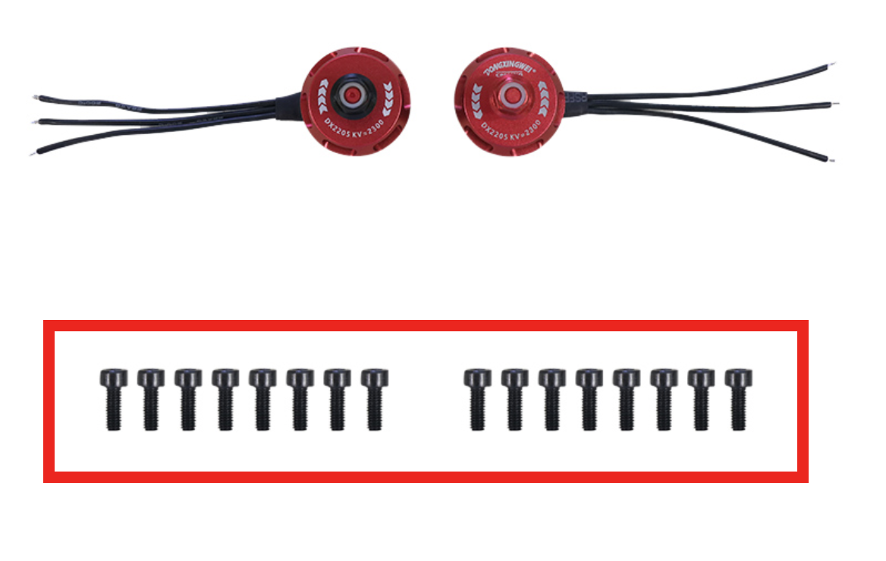
</figure>  

**Units:** 16 short, 16 long   
**Description:** A screw that can be screwed into a standoff or a motor. Included in the motors box.

### M3 Hex Key
<figure>
    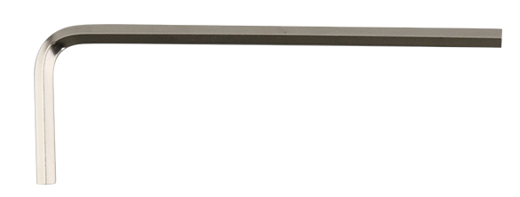
</figure>  

**Description:** Used to tighten the M3 bolts

## 5040 3-Blade Propeller 
<figure>
    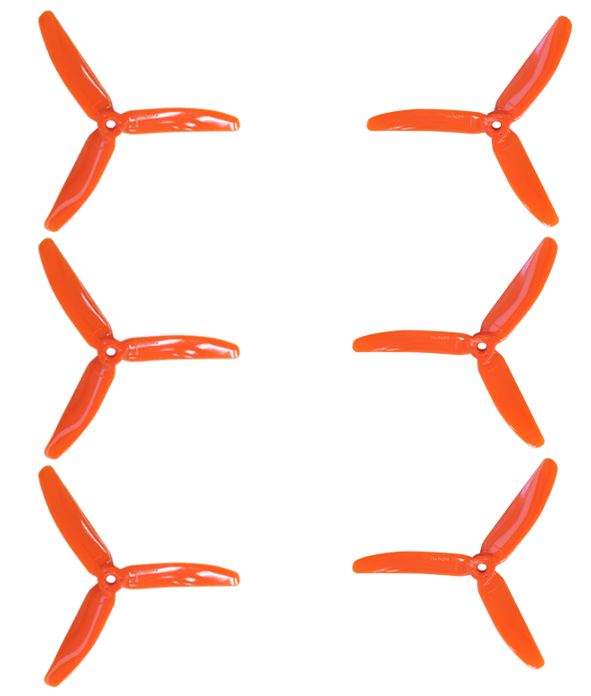
</figure>  

**Units:** 2 clockwise and 2 counterclockwise (extra CW and CCW included)

**Description:** A device with blades that turns rotational motion into thrust. 5 refers to the diameter in inches, and 4 refers to the distance the propeller would travel if turned one rotation without slippage, e.g. in jello. Three blades gives more lift for a given diameter than two blades - at the cost of efficiency.

### 8mm Wrench 
<figure>
    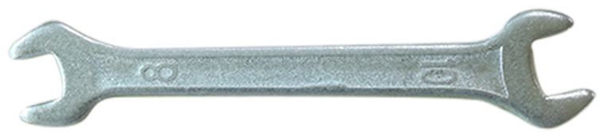
</figure>  

**Description:** Used to tighten the motor nuts that hold down the propellors

## 30A Brushless Electronic Speed Controller (ESC)
<figure>
    
</figure>  

**Units:** 4    
**Description:** An electronic component that sends variable amount of power to a motor, based on a specified input signal. Every motor needs one ESC.

## 2.0mm Bullet Connector 
<figure class="flow-subfigures">  
    <figcaption>Bullet Connectors</figcaption>
    <figure>
       <figcaption>Plug</figcaption>
       
    </figure>
    <figure>  
       <figcaption>Socket</figcaption>
       
    </figure>
</figure>

**Units:** 24 (12 plugs and 12 sockets)    
**Description:** The bullet connectors on the left are **plug** connectors and the ones on the right are **socket** connectors. A plug connector can be inserted into a socket connector to complete an electric connection.

## Raspberry Pi 3 Model B+ (Pi) 
<figure>
    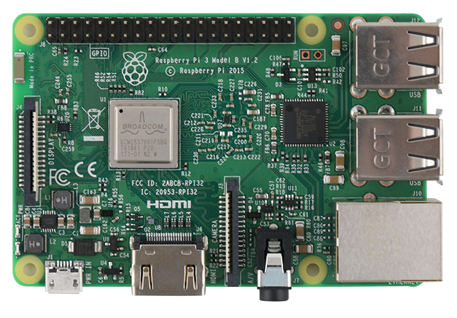
</figure>  

**Units:** 1   
**Description:** A single board computer that can execute code loaded via an SD card.

### 32GB Micro SD Card 

<figure>
    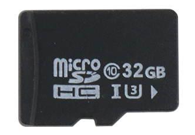
</figure>  

**Units:** 1   
**Description:** A memory device, especially notable because it can store code and be inserted into a Pi.

### Heat Sinks 
<figure>
    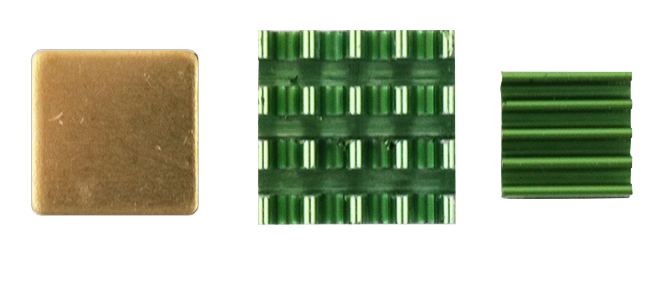
</figure>  

**Units:** 3 (14mm * 14mm * 7mm; 9mm * 9mm * 5mm; 12mm * 12mm * 1mm)    
**Description:** A device that helps dissipate heat. Heat sinks help to keep computer processors cool.

### Screwdriver
<figure>
    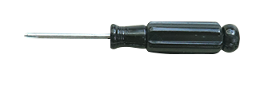
</figure>  

**Description:** Used to tighten the Pi Mount screws

### Perma-Proto Raspberry Pi Hat (Pi Hat) and Pin Header 
<figure>
    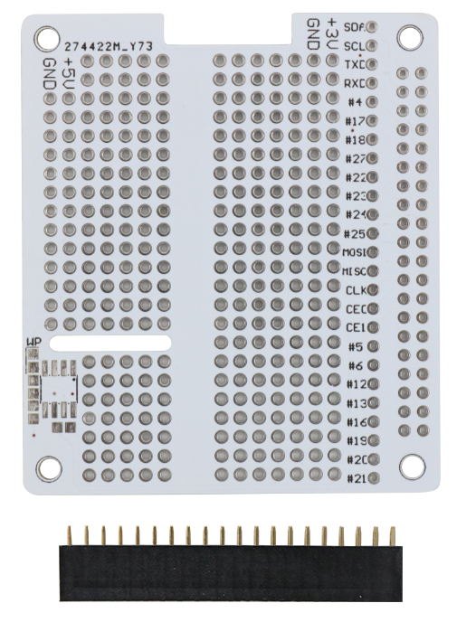
</figure>  

**Units:** 1    
**Description:** A breadboard specifically designed for easy attachment to a Pi. The header gets soldered to the Pi Hat to attach it to the Pi.

## Flight Controller (FC) 
<figure>
    <figcaption>Flight Controller Board and Vertical Pins</figcaption>
    
</figure>  

**Units:** 1 + 1  
**Description:** A flight controller is a device that contains a few sensors: an accelerometer and a gyroscope; together these sensors make an IMU. The accelerometer measures linear accelerations and a gyroscope measures angular velocities. A flight controller also sends input signals to the ESCs. There are extra wires included in the flight controller box. The drone only requires the flight controller board and the vertical pins.

### USB to Micro USB
<figure>
    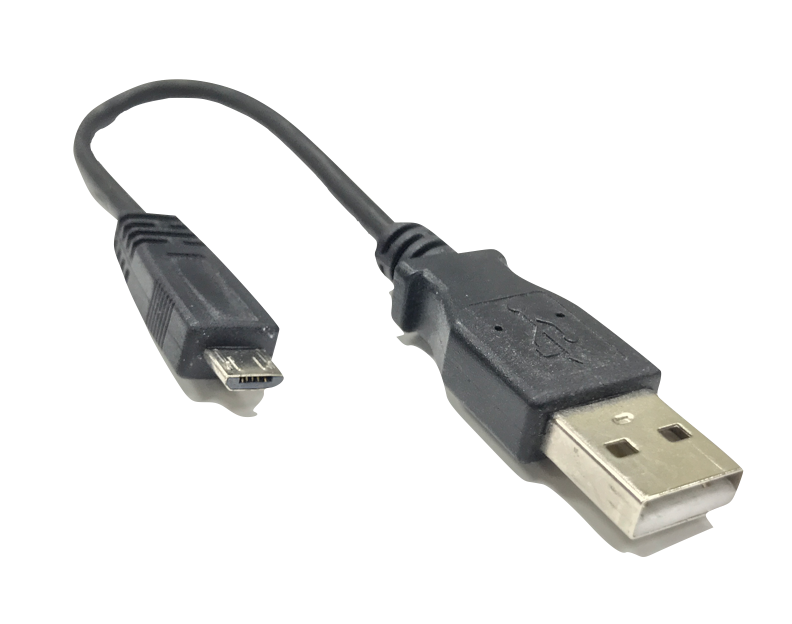
</figure>  

**Units:** 1
**Description:** Connects the flight controller to the Raspberry Pi.

## Arducam 5MP 1080p OV5647 Camera (Pi Cam) + 15pin Flexible Flat Cable (FFC) 
<figure>
    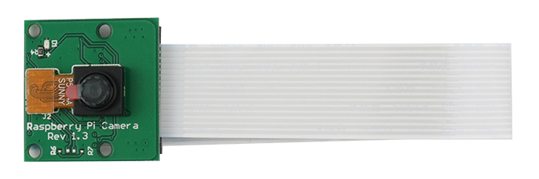
</figure>  

**Units:** 1 + 1   
**Description:** A sensor that observes 2D images of the world and reports it on a FFC cable. FFC included in pi cam box.

## Time of Flight Sensor (TOF) + TOF Sensor Cable 
<figure>
    
</figure>  

**Units:** 1  
**Description:** A sensor that measures distance to an object using infrared beams, then reports it on a wire.

## 1600mAh 3S 20C LiPo Battery 
<figure>
    
</figure>  

**Units:** 1   
**Description:** A lithium polymer battery used to power the drone.

### 12V 2-3S LiPo Battery Balancer/Charger 

<figure>
    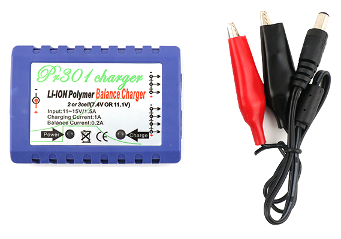
</figure>  

**Units:** 1   
**Description:** Safely charges and balances the LiPo battery

### AC/DC US Charge Adapter 

<figure>
    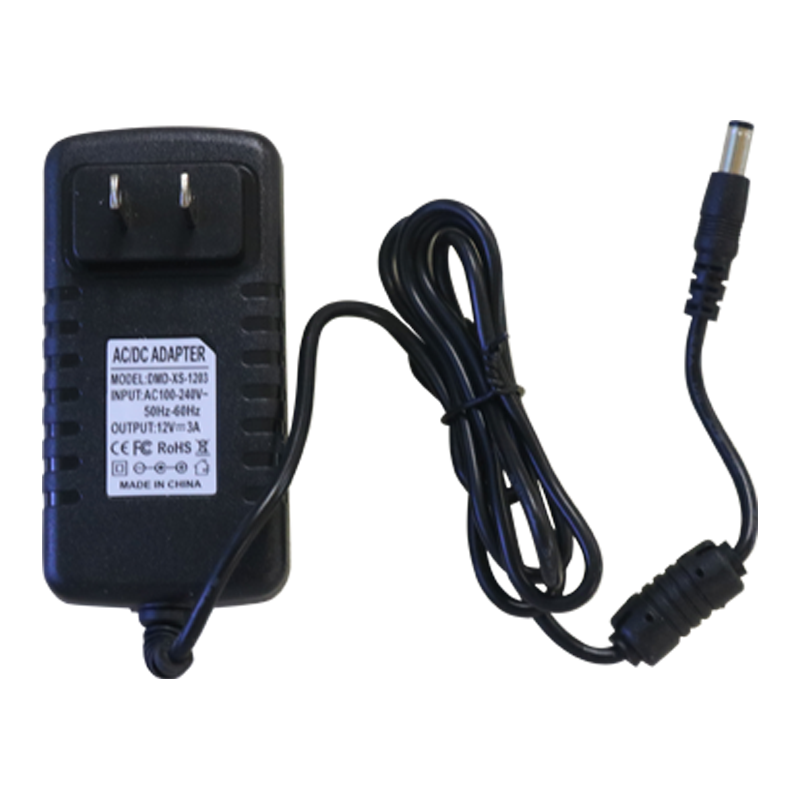
</figure>  

**Units:** 1   
**Description:** Connects the battery charger to a wall outlet

### Velcro Strap 
<figure>
    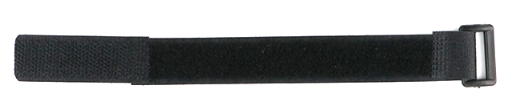
</figure>  

**Units:** 1    
**Description:** A velcro strip used to hold the battery to the drone.                     

## Heat Shrink
<figure>
    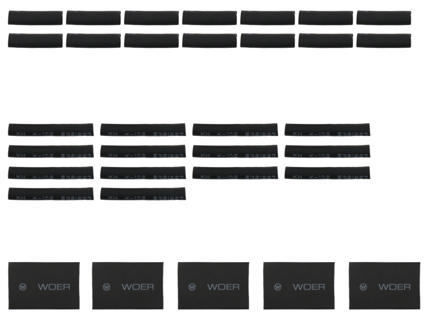
</figure>

**Description:** A heat shrink (a.k.a heatshrink or heat-shrink tubing) is a shrinkable plastic insulator tube used to insulate wires. It is commonly used as a "sleeve" over a solder joint.

## Zip Ties 
<figure>
    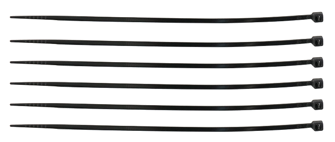
</figure>  

**Description:** A zip tie is a type of fastener for holding items together, primarily electrical cables or wires.       

## Extra Wires 
<figure>
    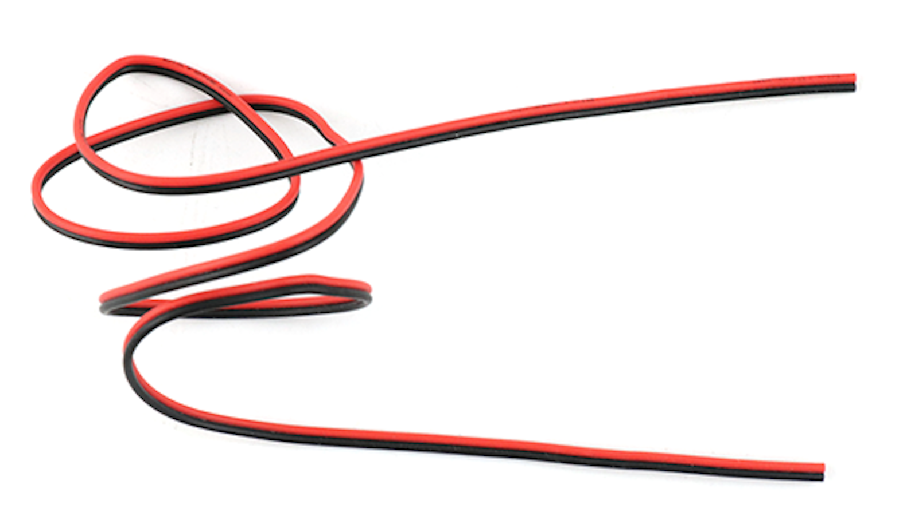
</figure>  

## Duckies
<figure>
    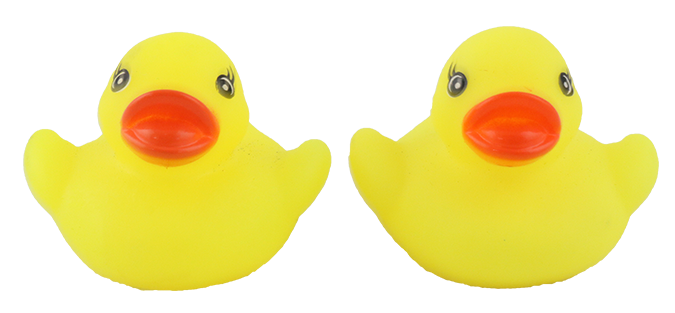
</figure>  

**Description:** The heart of Duckietown.
