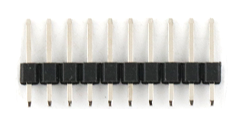
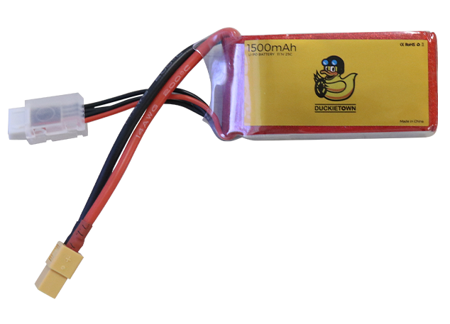

# Included Materials {#build-materials-included status=ready}

Welcome to your Duckietown Sky Drone kit! This section contains a list of parts and materials included in your kit.

Note: Depending on the hardware version of your drone kit, the components may look different, but the functionality will be the same.

## Your drone kit
<figure>
    
</figure>

## All materials included in the kit
<figure>
    
</figure>

## Drone Frame Kit
<figure class="flow-subfigures">  
<figcaption>Drone Frame Kit</figcaption>
     <figure>
       <figcaption>Closed</figcaption>
       
     </figure>
     <figure>  
       <figcaption>Open</figcaption>
       
     </figure>
</figure>

### Frame
<figure>
    <figcaption>Drone Frame</figcaption>
    
</figure>

**Units:** 1  
**Description:** A plastic racing quad frame. Included in the frame box.

### Power Distribution Board (PDB) {#materials-pdb}
<figure>
    
</figure>  

**Units:** 1  
**Description:** An electronic component that distributes power that it receives to other components connected to it. Included in the frame box.

### Plastic Frame Mounts and Pi Screws
<figure>
    
</figure> 
    
</figure>  

**Units:** 3    
**Description:** Small screws that are used to mount the Pi on top of the pi mount. Included in the frame box.

### Landing Gears
<figure>
    
</figure>  

**Description:** Feet that attach to the drone frame. Included in frame box

### Motor Spacers
<figure>
    
</figure>  

**Description:** 4x Spacers added to protect in case of crashing against its side.

## XT60 Connector {#materials-xt60}
<figure>
    
</figure>  

**Units:** 1

**Description:** The power connector cable that transfers power from the battery to the PDB.

## 2205 2300KV Brushless Motor {#materials-motors}
<figure>
    
</figure>  

**Description:** An actuator that spins at variable speeds. Although brushless motors can spin in either direction, the motor shafts are threaded so that as the propellor spins, it does not loosen the nut and fly off. You can identify which direction a motor should spin by noticing the direction of the arrows on top.

### Clockwise Motor {#materials-motors-cw}

<figure>
    
</figure>  

**Units:** 2

### Counter-clockwise Motor {#materials-motors-ccw}

<figure>
    
</figure>  

**Units:** 2

### Plastic Bolts
<figure>
    
</figure>  

**Units:** 8 thin screws, 11 plastic bolts  
**Description:** A screw that can be screwed through the pbd board through the frame to secure it. 

### M3 Hex Key
<figure>
    
</figure>  

**Description:** 

## 5040 3-Blade Propeller {#materials-props}
<figure>
    
</figure>  

**Units:** 2 clockwise and 2 counterclockwise (extra CW and CCW included)

**Description:** A device with blades that turns rotational motion into thrust. 5 refers to the diameter in inches, and 4 refers to the distance the propeller would travel if turned one rotation without slippage, e.g. in jello. Three blades gives more lift for a given diameter than two blades - at the cost of efficiency.

### 8mm Wrench {#materials-wrench-8mm}
<figure>
    
</figure>  

**Description:** Used to tighten the motor nuts that hold down the propellors

## Electronic Speed Controller (ESC) 
<figure>
    
</figure>  

**Units:** 4    
**Description:** An electronic component that sends variable amount of power to a motor, based on a specified input signal. Every motor needs one ESC.

## Raspberry Pi 3 Model B+ 
<figure>
    
</figure>  

**Units:** 1   
**Description:** A single board computer that can execute code loaded via an SD card.

### 16GB Micro SD Card {#materials-sd-card}

<figure>
    
</figure>  

**Units:** 1   
**Description:** A memory device, especially notable because it can store code and be inserted into a Pi.

### Heat Sinks {#materials-heat-sinks}
<figure>
    
</figure>  

**Units:** 3 (14mm * 14mm * 7mm; 9mm * 9mm * 5mm; 12mm * 12mm * 1mm)    
**Description:** A device that helps dissipate heat. Heat sinks help to keep computer processors cool.

### Screwdriver
<figure>
    
</figure>  

**Description:** Used to tighten the [Pi Mount screws](#materials-pimount-screws)

### Perma-Proto Raspberry Pi Hat (Pi Hat) and Pin Header {#materials-pihat}
<figure>
    
</figure>  

**Units:** 1    
**Description:** A breadboard specifically designed for easy attachment to a Pi. The header gets soldered to the Pi Hat to attach it to the Pi.

## (UBEC) universal battery eliminator circuit
<figure>
    
</figure>  

**Units:** 1   
**Description:** An electronic component that steps down the voltage from 12V from the battery to 5V for the Pi

## Flight Controller (FC) 
<figure>
    <figcaption>Flight Controller Board and Vertical Pins</figcaption>
    
</figure>  

**Units:** 1 + 1  
**Description:** A flight controller is a device that contains a few sensors: an accelerometer and a gyroscope; together these sensors make an IMU. The accelerometer measures linear accelerations and a gyroscope measures angular velocities. A flight controller also sends input signals to the ESCs. There are extra wires included in the flight controller box. The drone only requires the flight controller board and the vertical pins.

### USB to Micro USB {#materials-usb-to-micro-usb}
<figure>
    
</figure>  

**Units:** 1
**Description:** Connects the [flight controller](#materials-fc) to the [Raspberry Pi](#materials-pi).

## Arducam 5MP 1080p OV5647 Camera (Pi Cam) + 15pin Flexible Flat Cable (FFC) 
<figure>
    
</figure>  

**Units:** 1 + 1   
**Description:** A sensor that observes 2D images of the world and reports it on a FFC cable. FFC included in pi cam box.

## Infrared Sensor (IR) + IR Sensor Cable 
<figure>
    
</figure>  

**Units:** 1 + 1  
**Description:** A sensor that measures distance to an object using infrared beams, then reports it on a wire.

### 90 degree pins an straight pins
<figure>  
  <figcaption>Pins</figcaption>
  
</figure>

### Small Jumper

**Description:** !Image pending! its purpose is to short ports 5 and 6 on the pi hat to make drone switch from its own internet to a home router.

## 1500mAh 3S 20C LiPo Battery {#materials-battery}
<figure>
    
</figure>  

**Units:** 1   
**Description:** A lithium polymer battery used to power the drone.

### 12V 2-3S LiPo Battery Balancer/Charger {#materials-battery-charger}

<figure>
    
</figure>  

**Units:** 1   
**Description:** Safely charges and balances the LiPo battery

### AC/DC US Charge Adapter {#materials-battery-charger-adapter}

<figure>
    
</figure>  

**Units:** 1   
**Description:** Connects the battery charger to a wall outlet

### Velcro Strap {#materials-velcro}
<figure>
    
</figure>  

**Units:** 1    
**Description:** A velcro strip used to hold the battery to the drone.                     

## Voltage Reader
<figure>
    
</figure>

**Description:** A small volatage reader that directly connects to the battery crhaging port to read its voltage level.

## Zip Ties {#materials-zipties}
<figure>
    
</figure>  

**Description:** A zip tie is a type of fastener for holding items together, primarily electrical cables or wires.       

## LED and resistors
<figure>
    
</figure>  

## USB SD card reader 
<figure>
    
</figure>  

**Description:** A USB sd card reader to help you flash the drones software later in the build.

## Extra hardware + Wiring 
<figure>
    
    
    
</figure>  

**Description:** Extra hardware to secure down drone components. Also extra wiring.

## Duckies
<figure>
    
</figure>  

**Description:** The heart of Duckietown.
