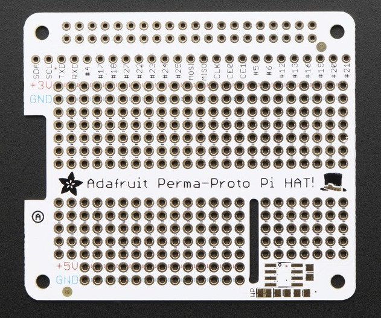
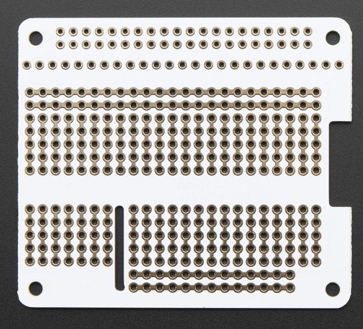
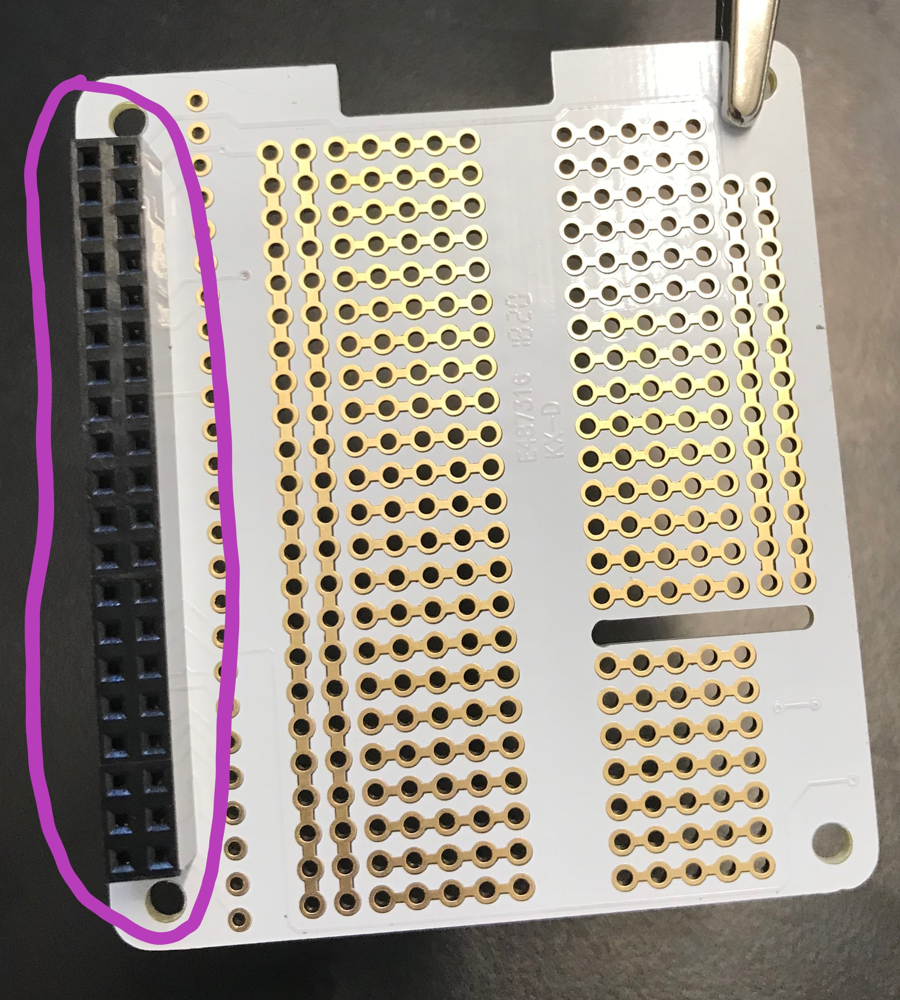
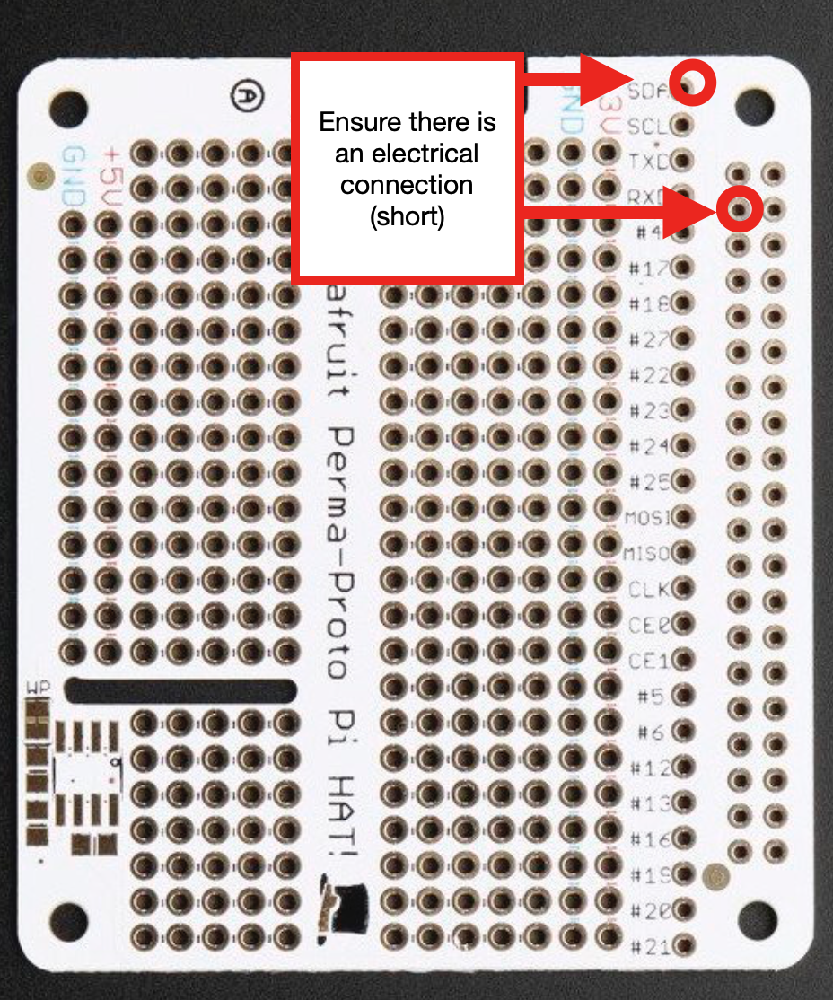
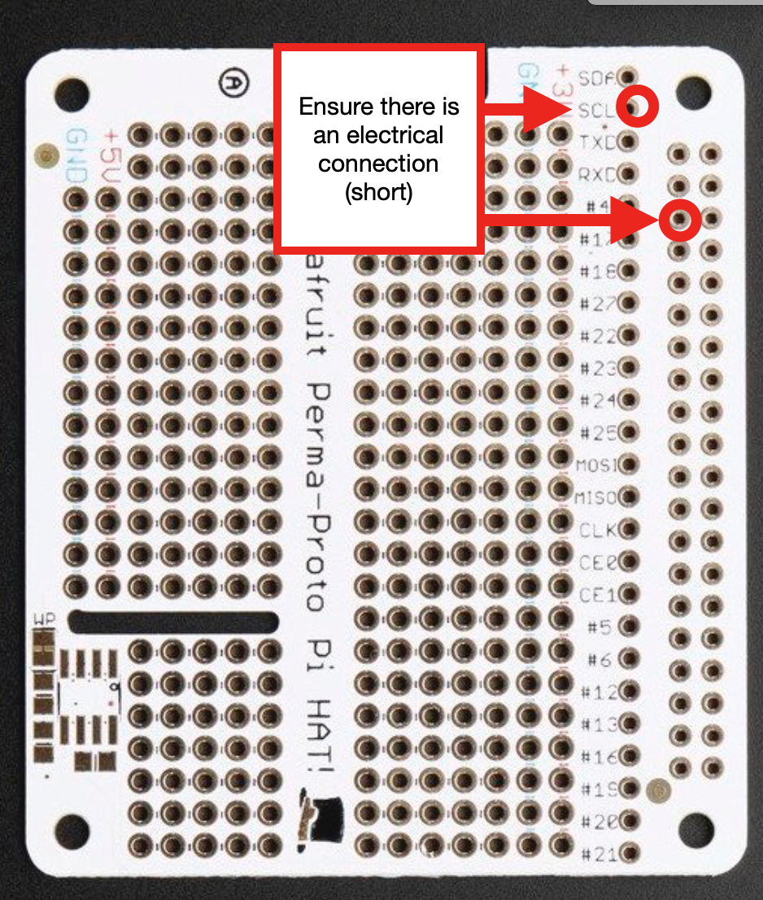
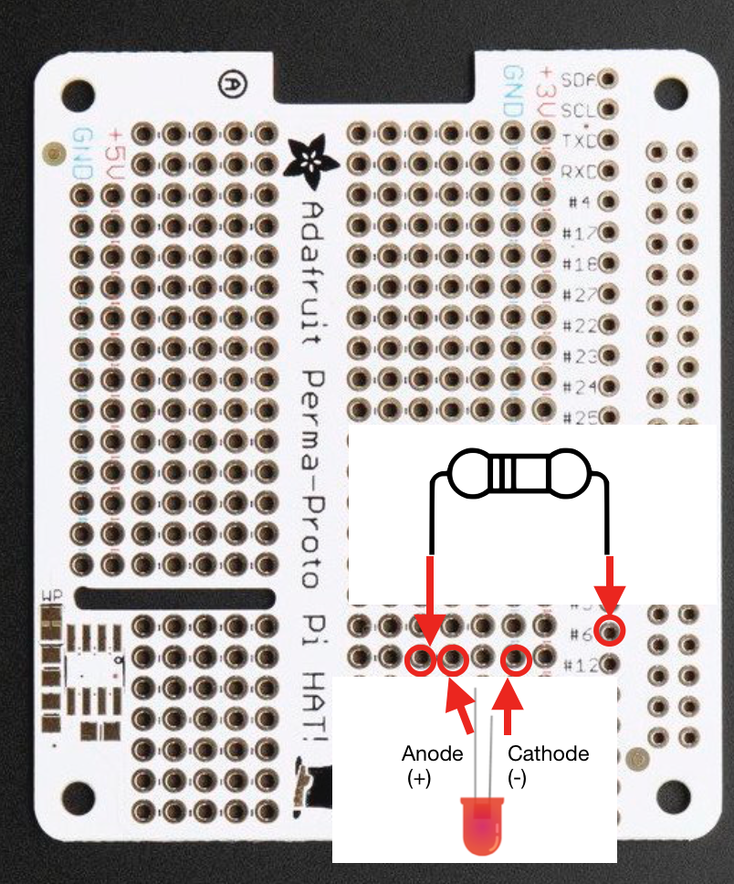
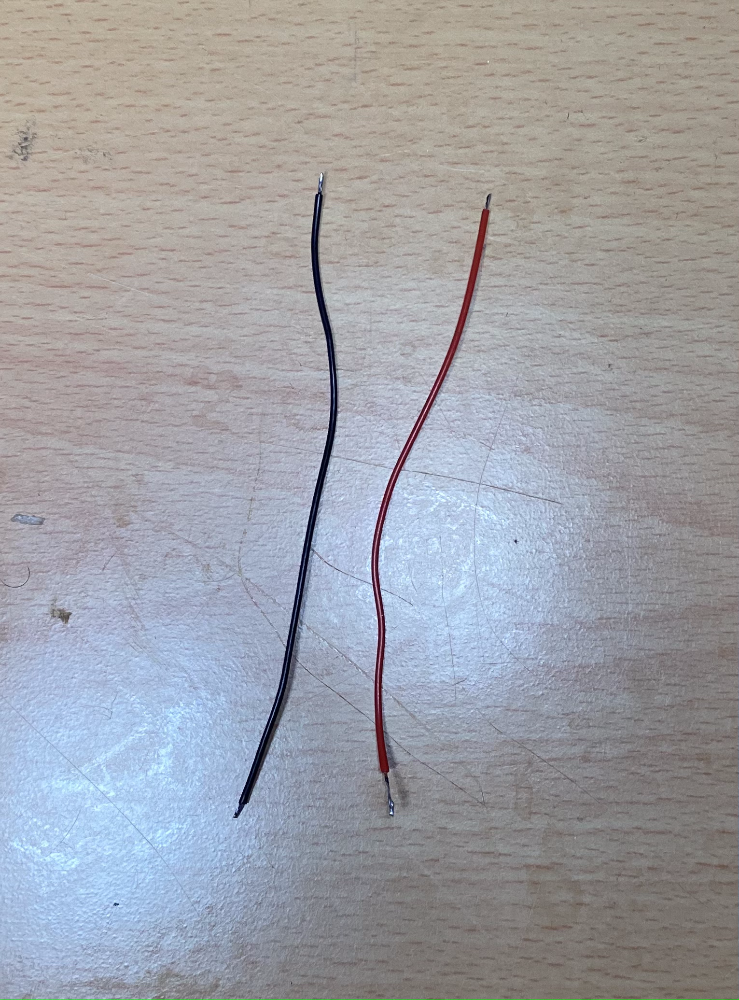

# Part 1: Raspberry Pi and Power Distribution Instructions {#build-part1-instructions status=ready}

**Expected Time**: 3 hours

## Preliminary Tasks

### Charge the Battery

1. Start charging your drone battery so it is ready when you need it.

Note: **Never** leave the battery charging unattended. The battery takes about 2 hours to charge

### Download Image and Image Flashing Software

1. If you have not already, on a base station, download the image flashing tool [Etcher](https://www.balena.io/etcher/).

1. If you have not already, on a base station, download the latest drone [image](#materials-file-downloads).

1. Connect the micro SD card to the workstation. Use the micro SD to USB card reader if the base station does not have a micro SD port.

1. Open Etcher and select the downloaded drone image. Then select the micro SD card as the drive to flash. Finally, click the "Flash" button.

Note: Double check that the "drive" is your micro SD card. You may be prompted to enter the base station password to proceed. This is normal; flashing an SD card deletes everything that is on it, so Etcher is making sure this process is OK with you.

Note: flashing will take 1 - 2 hours. In the meantime, you can move on to the next sections.

## Attach the Pin Header to the Pi Hat

### Identify the front and back

Identify the side of the Pi Hat that has writing on it - this side is the front, and the side without writing is the back. Tip: take note of where the slot slot in the Pi Hat to help with matching the orientation in the following instructions.

<figure class="flow-subfigures">  
    <figcaption>Pi Hat</figcaption>
    <figure>
       <figcaption>Front</figcaption>
       
    </figure>
    <figure>  
       <figcaption>Back</figcaption>
       
    </figure>
</figure>

### Insert the Pin Header

Insert the Pin Header into the back of the Pi Hat as shown in the image

<figure>  
   <figcaption>Pin Header Inserted into Back of Pi Hat</figcaption>
   
</figure>

### Solder the Pin Header

1. Review the [through-hole soldering technique](#prereq-solder-through-hole)

1. Use the helping hands to assist as you solder the pin header

***video tutorial***: [video instructions part 1](https://drive.google.com/file/d/1_3pavoqrBqVhaXVO_ckga5tiSTCBStaA/view?usp=sharing)

***video tutorial***: [video instructions part 2](https://drive.google.com/file/d/1qAHN24WlXQ8VcRRAgeP4UyiBG9yFqq_5/view?usp=sharing)

***video tutorial***: [video instructions part 3](https://drive.google.com/file/d/1bRUzxmqFLdeEPoKqYJNIGYimHYFPo2lI/view?usp=sharing)

Note: It's very easy to add too much solder and create a solder bridge between adjacent pins. Visually inspect your soldering to make sure that adjacent pins are not connected by globs of solder. If you have a solder bridge, try the technique shown in [this video](https://www.youtube.com/watch?v=gJPLs7J4oCk). If this does not work, you can use desoldering wick or a solder sucker to remove the excess solder.

Sometime too much heat when soldering the pin header can mess up the Pi Hat connections. To make sure the connections are still good, do a [connectivity check](https://docs.duckietown.org/daffy/opmanual_sky/out/build_multimeter.html) on the Pi Hat; verify there is:

- A short between the hole labelled SDA on the Pi Hat and the pin at row 2 column 1 of the pin header that you soldered.

<figure>  
   <figcaption>Check for SDA connection</figcaption>
   
</figure>

- A short between the hole labelled SCL on the Pi Hat and the pin at row 3 column 1 of the pin header that you soldered.

<figure>  
   <figcaption>Check for SCL connection</figcaption>
   
</figure>

If you make a mistake while soldering, review the [instructions for fixing soldering mistakes](#prereq-solder-mistakes)

## Attach the LED and Resistor to the Pi Hat

Solder the 680 Ohm resistor and your LED to the Pi Hat as shown in the image.

Remark: The value of the resistor can be modified to adjust the brightness of the LED at full power. If you have additional resistors, you can modify this resistance by using a resistor with a smaller resistance, or by adding resistors in parallel later on. A helpful thread for understanding why this resistance should work is found [here](https://electronics.stackexchange.com/questions/378129/can-i-use-blue-green-leds-as-mcu-state-indicators-on-3-3-v-power).

Note: The direction of the resistor does not matter, but the direction of the LED **does matter.** Be sure to place the cathode (shorter end) into the GND rail.

<figure>  
   <figcaption>Extra resistor wire snipped</figcaption>
   
</figure>

You've just finished the LED circuit! In a future lesson, you will learn how to send electricity through GPIO pin #6 to the LED and resistor, and then back to ground.

## Powering the Pi Hat

### Prepare

Cut off about 4.5 inches of both the red and black wire

<figure>
   <figcaption> Wire preparation</figcaption>
   <figure>
       <figcaption>Wires pre-cut</figcaption>
       
   </figure>
   <figure>
       <figcaption>Wires post-cut (stripped and tinned)</figcaption>
       
   </figure>
</figure>

### Strip and Tin

1. Strip the end of the red and black **OUT** wires (the wires you just cut) so that there is about 5mm of exposed wire.

1. Twist together the ends of the wires and *lightly* tin them. The wires need to be thin enough to fit through the holes in the Pi Hat.

### Solder

Solder the **red (+)** OUT wire to the +5V Rail, and solder the **black (-)** OUT wire to the GND rail, as shown in the image.

 Remark: Any hole on the rails will work; however, for wire organization, it is better to use a hole on the 5V rail that is shown. If you mess up soldering, it is ok to leave the mistake and use a different hole.

 <figure>
     <figcaption>Wires Soldered to Pi Hat</figcaption>
     
 </figure>

Do a [connectivity check](https://docs.duckietown.org/daffy/opmanual_sky/out/build_multimeter.html) on the Pi Hat. Verify there is:

 - **no short** between the +5V rail and the GND rail on the Pi Hat

## Prepare the PDB

### Tin the PDB

Similar to exposed wires, the metal pads on a PDB need to be tinned. This will allow tinned wires to be joined to the pads - and therefore the PDB.

1. Review the [pad-tinning tutorial](#prereq-tin-pad)

1. Tin every pad on the PDB, **except** the 5V and 12V pads.

Note: Be careful not to aggresively push the soldering iron tip into the PDB, as too much force will cut the pads right off!

<figure>
    <figcaption>Tinned PDB</figcaption>
    
</figure>

***video tutorial***: [video instructions](https://drive.google.com/file/d/1xVlTBsAtarXKaJycGvJ66VYyJhe6loq3/view?usp=sharing)

Note: For the remainder of the instructions, unless stated otherwise, **red** wires should be soldered to **positive (+)** pads and **black wires** should be soldered to **ground (-)** pads. 

## Connecting the Pi Hat to the PDB

### Solder

Solder the **red (+)** IN wire to the **5V** pad on the PDB, and solder the **black (-)** IN wire to the **GND** pad on the PDB, as shown in the image. Solder the wires at a slight angle (~10-20°) away from the board (as shown in Figure 6.9).

Note: Any of the tinned (+) pads will work; however, using the pad shown in the image will help with wire organization later on.

## Solder the XT60 Battery Connector to the PDB

### Strip and Tin

1. Measure out from the ends of the battery connector a length of 3 inches. Cut off the excess.
2. Strip the ends of the battery connector so that about 1cm of wire is exposed.
3. Twist and tin the exposed ends of the XT60 connector.

### Solder (Through Hole)

Solder the XT60 **red (+)** wire through the positive (+) Lipo 3-4s hole on the PDB, and solder the **black (-)** wire throught the ground (-) Lipo 3-4s hole on the PDB, as shown in the image.

Note: This wire is thin so when soldering, apply a lot of solder in order to fill up any gaps. It will take a while for the solder to melt. Make sure your soldering iron is turned all the way up and be patient.

Note: Do not solder the wires flat against the PDB - solder them at ~20° angle away from the board. If you solder them flat, then you will not be able to fit the PDB into the drone frame.

<figure>
    <figcaption>XT60 soldered to PDB</figcaption>
    
</figure>

### Attaching PDB to Frame

For now, we're going to attach the PDB to the bottom platform. 

Flip the bottom platform over, (Pressnuts facing down is the back side) 
 
Using 4  12mm M3 screws and 4 M3 nuts, attach the PDB to the bottom platform. 

<figure>
    <figcaption>PDB attached to Bottom Platform</figcaption>
    
</figure>

### Checkpoint
Visually inspect the drone to verify the following:

  - All red wires connected to the PDB are connected to positive (+) pads

  - All black wires connected to the PDB are connected to negative (-) pads

  - The wires on the IN side - **NOT** the OUT side - of the BEC are soldered to the PDB

Do a [connectivity check](https://docs.duckietown.org/daffy/opmanual_sky/out/build_multimeter.html) on the PDB; verify there is:

  - a short between any positive (+) pad and any other positive (+) pad

  - a short between any negative (-) pad and any other negative (-) pad

  - **no short** between any positive (+) pad and any negative (-) pad

**ONLY** if the connectivity check passed, do a [DC voltage check](https://docs.duckietown.org/daffy/opmanual_sky/out/build_multimeter.html) on the PDB; plug in a 12V battery and verify there is:

  - ~0V between any positive (+) pad and any other positive (+) pad

  - ~0V between any negative (-) pad and any other negative (-) pad

  - ~12V between any positive (+) pad and any negative (-) pad.

  NOTE: If the battery is X volts instead of 12 volts (e.g. 10), then the multimeter will show X volts instead of 12 volts.

**ONLY** if the DC voltage check passed, re-connect a battery to your drone and verify the following:

  - The bottom of the drone frame is illuminating, due to the LEDs on the bottom of the PDB.

## Put Heat Sinks on Raspberry Pi

Attach the heat sinks to the Pi as shown in the pictures.

<figure class="flow-subfigures">  
    <figcaption>Put Heat Sinks on Pi</figcaption>
    <figure>
        <figcaption>Heat Sinks on Top of Pi</figcaption>
        
    </figure>
    <figure>  
        <figcaption>Heat Sinks on Bottom of Pi</figcaption>
        
    </figure>
</figure>  

## Attach the Pi Hat to the Pi {#build-part1-attach-pihat}

### Align the pins

Align the 2x40 GPIO pins on the Raspberry Pi with the 2x40 pin header that you soldered to the Pi Hat as shown in the image. (please ignore additional wires on the Pi Hat)

### Press down

Press the pin header down onto the GPIO pins to connect the Pi Hat

## Final Steps

Do another [connectivity check](https://docs.duckietown.org/daffy/opmanual_sky/out/build_multimeter.html) to verify that there is **no short** between the +5V rail and the GND rail on the Pi Hat.

### Verify that the Pi has power

1. Connect the battery

2. Verify that the Pi has a solid red light.

### Insert the SD card into the Pi

Insert your (now flashed) SD card into the SD card slot on the bottom of the Pi.

Note: The SD card direction does matter - the lettering on the SD card should be facing downward.

<figure class="flow-subfigures">  
    <figcaption>SD Card inserted in the Pi</figcaption>
    <figure>
        <figcaption>Bottom View</figcaption>
        
    </figure>
    <figure>  
        <figcaption>Top View</figcaption>
        
    </figure>
</figure>  

