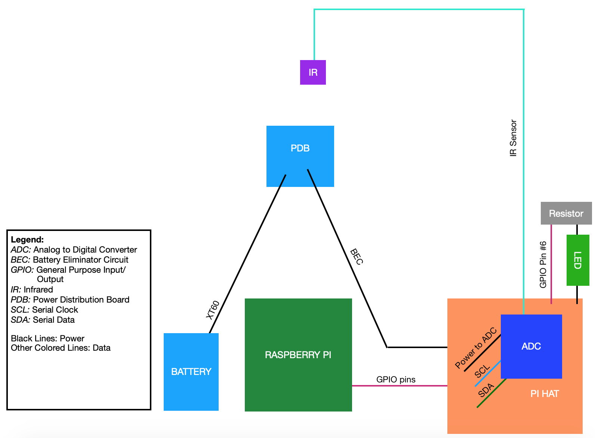

# Part 2: TOF Sensor Overview {#build-part2-overview status=ready}

## Preface

At a high level, a **sensor** is a device that _observes_ something about the world and reports its observations on an electrical wire. For example, a camera can be a sensor.

In contrast, an **actuator** is a device that _does_ something when provided power via an electrical wire. For example, a motor can be an actuator.

The simplest possible robot is one that has only actuators. However, a robot with any amount of autonomy would also require sensors. This is because such a robot would need observations about its world in order to decide what to do with its actuators.

In this part of the build, you will be adding your first sensor to the drone -- the Time of Flight (TOF) sensor. The TOF sensor is used to measure distance. We'll provide more details about the hardware used in this portion of the build, explain the circuit you'll be creating, and then get into the instructions.

## Required Materials
You will need Build Part 1 completed before you can begin this build part.

- **Part : Quantity**
- TOF Sensor and Wire : 1
- Soldering Tools

## Detailed Hardware Descriptions

### Time of Flight (TOF) Sensor
The TOF sensor is used to measure distance. On the drone, we use this sensor to measure the height of the drone above the ground. The sensor works by emitting infrared light from one side, and measuring the time it takes for the light to be reflected back to the sensor. Based on this value and the known speed of light, the distance traveled can be calculated. Therefore, the sensor on the drone is able to determine the instantaneous height of the drone during flight.

TODO: insert the time of flight sensor and wire picture

<figure>
    <figcaption>Time of Flight Sensor and Wire</figcaption>
    
</figure>

## Build Progress

After completing this section, your build will match the diagram below. Compare this diagram to the [completed drone diagram](#diagram-complete) and to the Part 1 diagram to see how what you're building up to the final result.

TODO: insert diagram part 2 png 

<figure>  
  <figcaption> Diagram for Build Part 2 </figcaption>
  
</figure>

The TOF sensor receives power from the Pi Hat. When fucnctioning, the sensor outputs a 11 bit digital signal. This signal is passed through the Pi also using the Pi hat inputs. 

