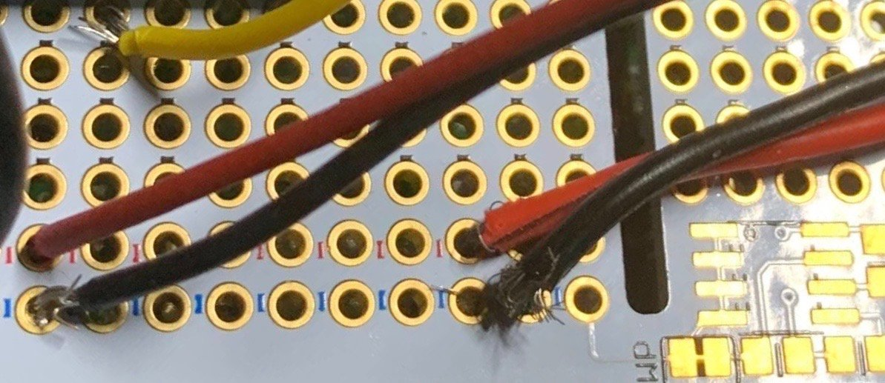

# Part 2: TOF Sensor Instructions {#build-part2-instructions status=ready}

**Expected Time**: 15 mins

## Connecting TOF sensor to Pi

The 4 colored wires of the TOF sensor are pretinned, therefore, there's no need to tin

### Solder the TOF Sensor Wires to the Pi Hat

Following the diagram below, insert a wire into the correct hole in the front of the Pi Hat. Then, flip the Pi Hat over to solder the wire on the back of the Pi Hat using the [through-hole soldering technique](#prereq-solder-through-hole).

Note: the color of the wire does not actually matter, but traditionally, Black wires are used for grounding and Red for Power.

First, we need to power the TOF sensor,

1. Solder the **red** TOF Sensor Wire to the 5V rail

2. Solder the **black** TOF Sensor Wire to the GND rail

3. Solder the **blue** TOF Sensor Wire to the SDA rail

4. Solder the **yellow** TOF Sensor Wire to the SCL

NEED: PIC of TOF sensor soldered to Pi hat
<!--
<figure>
   <figcaption>TOF sensor wires soldered to Pi Hat</figcaption>
   
</figure>
-->

Do a [connectivity check](https://docs.duckietown.org/daffy/opmanual_sky/out/build_multimeter.html) on the Pi Hat; verify:

- There is **NO** electrical connection (short) between the 5V and GND rails.

- There is **NO** electrical connection (short) between the SCL and SDA wires

- There are **NO** stray wire strands that are connecting adjacent pins, especially between 5V and GND (see image below)

<figure>
   <figcaption>BAD: Wire strands causing shorts</figcaption>
   
</figure>

## Reattach the Pi Hat to the Pi

Reattach the Pi Hat to the Pi by aligning the GPIO pins with the pin header and pressing down. Refer to [part 1](#build-part1-attach-pihat) for detailed instructions on how to attach the Pi Hat.
