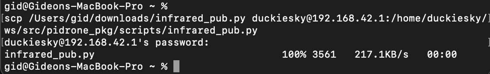

# Part 2: TOF Sensor Software Setup and Checkpoint {#build-part2-checkpoint status=ready}

**Expected Time**: 30 minutes

## Overview
In the previous version of the drone, we used an Infrared (IR) Sensor. However, this version features an upgraded TOF sensor. We will need to overwrite the old Infrared Sensor script with a new script designed for the TOF sensor

### Preliminaries
1. Navigating a terminal:  
 "CD *directory* " is used to change directories  
 "CD .." is used to return to the previous directory.  
 "PWD" is used to print the current directory you're in.  
 "LS" is used to list file or directories.
  
2. Download this file and store in your downloads folder: [TOF sensor script](https://drive.google.com/file/d/1kzBh2y72ne7w9zU3RDL48IB1u5xJhhaF/view?usp=sharing)

### Connect to the drone

1. Plug the battery into your drone build and connect to the drone's wifi network. By default, the network is named, *defaultdrone*, and the password is *bigbubba*.
2. Browse to the drone's code editor: [http://192.168.42.1:8081](http://192.168.42.1:8081)
3. In a new tab, browse to the web interface: [http://192.168.42.1](http://192.168.42.1). The web interface is what you will use to fly the drone. It also contains graphs that show data from the sensors.

### Pathway to current Infrared script
1. In the code editor, click the menu bar in the top left corner, then click Terminal > New Terminal
2. Type `./start` and press enter
3. Go back to the web interface tab, wait about 5 seconds, and refresh the page. Make sure that you see "Connected" at the top of the page. If you do not see this, wait a few more seconds and try refreshing again.
4. Locate and record the drone's ip address (You'll need this later)
5. Create a new terminal and navigate to the scripts folder "cd scripts". This should be in the PIDRONE_PKG folder. 
6. Print out the pathway "pwd" , record this and add "/infrared_pub.py" to the end of the text. 

### Pathway to downloaded script
Now, we're going to find out the path to our downloaded script.
1. Open up the terminal/command prompt on your computer.
2. Navigate to your downloads folder "cd downloads"
3. Print out the pathway "pwd", record this and add "/infrared_pub.py" to the end of the text

### Making edits for the Lidar sensor
1. Remain connected to the drone's wifi.
3. Open up the terminal on your laptop and run the following command (Fill in duckiesky for username, the drone's ip address, and the specified pathways):  
"scp *Pathway to downloaded script* username@192.drone.ip???.42: *Pathway to current Infrared Script*"  

Note: Don't include the quotation marks when copying the command.

You'll be asked to enter the drone's password, this is the same as the password for the wifi *bigbubba

<figure>  
   <figcaption>Example of a successul command run</figcaption>
   
</figure>

## Reading the TOF sensor on the web interface

You will now checks to see if the TOF sensor on your drone is working properly. You will using the drone software and the web interface to see drone's height estimate.

### Start up the code

1. In the code editor, click the menu bar in the top left corner, then click Terminal > New Terminal
2. Type `./start` and press enter
3. Go back to the web interface tab, wait about 5 seconds, and refresh the page. Make sure that you see "Connected" at the top of the page. If you do not see this, wait a few more seconds and try refreshing again.

### Test

1. locate the *Height Readings* chart on the web interface

1. Use your hand to move the TOF sensor closer and further to an object and check that the Height Readings chart is changing

Congrats on finishing Build Part 2!
