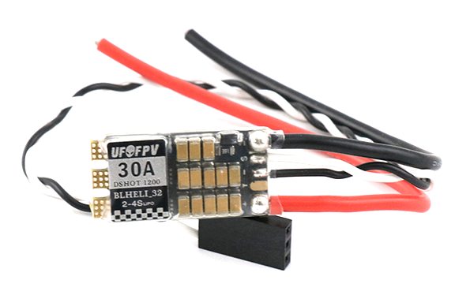
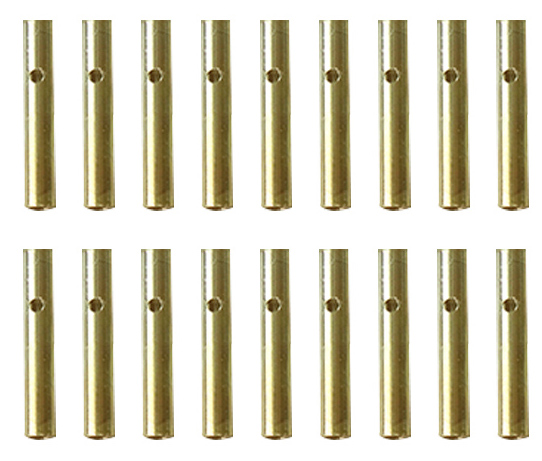
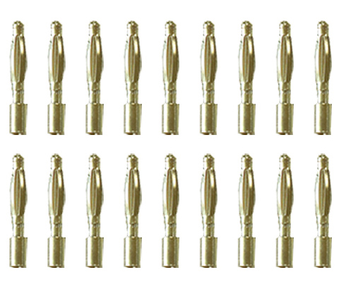
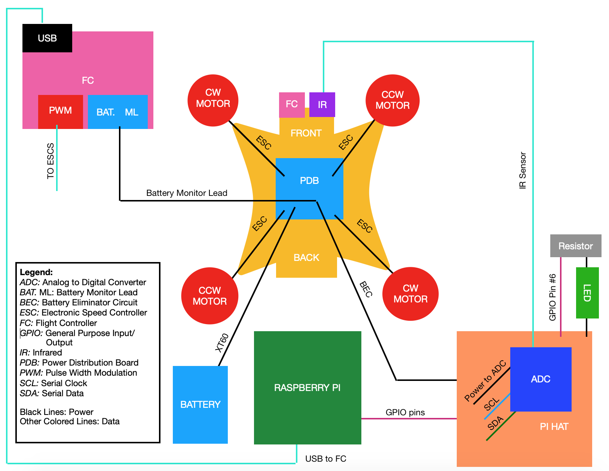

# Part 3: Motors and ESCs Overview {#build-part3-overview status=ready}

## Preface
In this phase of the build, you'll be adding the essential elements of every drone-- the motors, ESCs, and the flight controller.

## Required Materials

**Part : Quantity**
- [Counter-clockwise Motors](#materials-motors-ccw) : 2
- [Clockwise Motors](#materials-motors-cw) : 2
- [Long M3 Bolts](#materials-bolt-m3) (included w/ motor) : 16
- [Short M3 Bolts](#materials-bolt-m3) (included w/ motor) : 4
- [Electronic Speed Controllers](#materials-esc) (ESCs) : 4
- [Bullet Connectors](#materials-bullet-connectors) : 12 Plugs, 12 Sockets
- [Soldering Tools](#materials-soldering-tools)
- Flight Controller : 1
- Spare wire (Red & Black) : 1

## Detailed Hardware Descriptions

### Motors

<figure>
    
</figure>  

### ESCs

An Electronic Speed Controller (ESC) is used to regulate the speed of a motor according to a signal from the flight controller. A brushless motor would not be able to spin without an ESC, as they are responsible for changing the magnetic fields that generate a moment to make the motor spin.

<figure>
     <figcaption>Electronic Speed Controllers</figcaption>
    
</figure>

### Bullet Connectors

Bullet connectors are used to connect two wires together in a way that allows them to be disconnected easily. It is useful to use these to connect the motors to the ECSs because if a motor is spinning in the wrong direction, you can simply switch two of the motor/ESC connections and the motor direction will reverse (more on this Later). Additionally, If an ESC or motor goes bad, bullet connectors makes it easier to swap out those parts.

<figure class="flow-subfigures">  
    <figcaption>Bullet Connectors</figcaption>
    <figure>
       <figcaption>Socket</figcaption>
       
    </figure>
    <figure>  
       <figcaption>Plug</figcaption>
       
    </figure>
</figure>

## Build Progress

After completing this section, your build will match the diagram below. Compare this diagram to the [completed drone diagram](#diagram-complete) to see how what you're doing now fits into the final result.

<figure>  
  <figcaption> Diagram for Build Part 3 </figcaption>
  
</figure>

 The Pi receives IMU sensor data from the flight controller, and sends the flight controller values for roll, pitch, yaw, and throttle. The flight controller converts these values to PWM commands for each motor, and sends the values to each ESC. The ESCs receive power from the PDB, and use the PWM signal from the flight controller to control how fast the motors are spinning.
