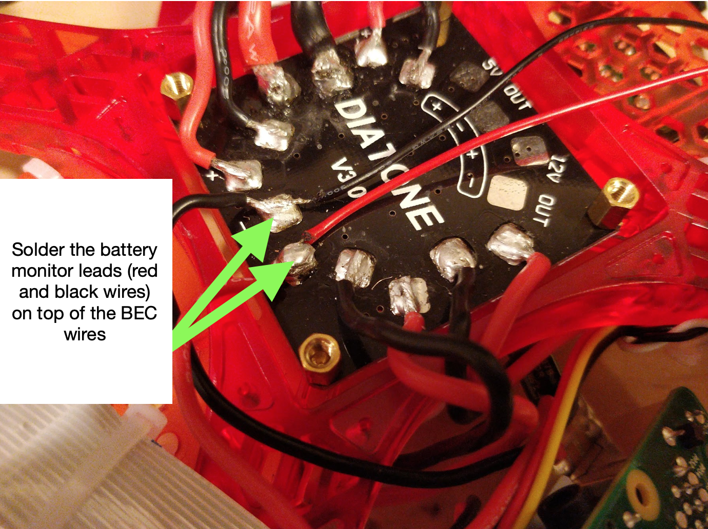

# Part 3: Motors, and ESCs Instructions {#build-part3-instructions status=ready}

**Expected Time**: 5 hours

Note: Sometimes parts will have wires already tinned out-of-the-box by the manufacturer (i.e. pre-tinned). You can identify this by: 1) the "shininess" of the tip of a wire and 2) the inability to fray the wire strands of the tip of a wire. However, such tinning is often ineffective. Cut off any pre-tinned tips, then strip and tin the part yourself.

## ESC bullet connectors

In this step you will solder bullet connectors onto the ESC wires and the motor wires so that you can easily connect them later on.

### Review soldering tutorial

Before beginning this section, please refer to a bullet connector soldering [tutorial](https://youtu.be/3oBy-jV9ajE).    

Note: You can use any setup to hold the bullet connector, so long as the setup is not thermally conductive. Also, if you have trouble soldering the bullet connectors, you may need to use a smaller soldering iron tip. Wait at least 15 minutes or longer for the soldering iron to completely cool down after unplugging before attempting to swap the soldering iron tip.

### Strip and Tin the ESC power wires

1. Strip about 5mm from the ends of the red and black wires on each ESC

1. Tin the red and black wires on each ESC

### Solder the socket bullet connectors to the ECS wires

For each ESC:

1. Solder a socket bullet connector to the end of each of the 3 blue ESC wires.

1. Put a heat shrink over each solder joint. For socket connectors: the heat shrink should cover the solder joint on one end and run the entire length of the bullet connector. Apply heat to shrink the heat shrink.

<figure>  
    <figcaption>Put Heat Shrinks on Socket Bullet Connectors</figcaption>
    <figure>
        <figcaption>Socket Bullet Connectors on ESCs</figcaption>
        
    </figure>
    <figure>  
        <figcaption>Socket Bullet Connector with Heat Shrinks</figcaption>
        
    </figure>
</figure>  

## Motor bullet connectors

### Strip the motor wires

1. Strip about 5mm from the ends of the three black wires on each motor

### Tin the motor wires

1. Tin the ends of the three black wires on each motor

### Solder the plug bullet connectors to the motor wires

For each motor:

1. Solder a plug bullet connector to each of the motor's wires.

1. Put a heat shrink over each solder joint. For male connectors: the heat shrink should cover the solder joint on one end and run only the short length of the cylindrical part. Apply heat to shrink the heat shrink.

<figure>  
    <figcaption>Put Heat Shrinks on Plug Bullet Connectors</figcaption>
    <figure>
        <figcaption>Plug Bullet Connectors on Motor wires</figcaption>
        
    </figure>
    <figure>  
        <figcaption>Plug Bullet Connector with Heat Shrinks</figcaption>
        
    </figure>
</figure>     

Visually inspect each ESC and verify that the heat shrinks are on properly; there should be no exposed wires and each heat shrink should be a tight fit.

- Visually inspect that each of the following is stripped and tinned: 4 ESCs, 4 motors

- Do a [connectivity check](https://docs.duckietown.org/daffy/opmanual_sky/out/build_multimeter.html) on the XT60 connector cable; verify there is no short between the red and black wire.

- Do a [connectivity check](https://docs.duckietown.org/daffy/opmanual_sky/out/build_multimeter.html) on each ESC; for each ESC, verify there are no shorts between any two wires you soldered.

## Solder ESCs to the PDB

An ESC (i.e. Electronic Speed Control) is a component which requires power. It takes this power and provides a variable amount of it to a motor; since a motor's RPM depends on how much power it gets, an ESC can control how fast a motor spins by controlling how much power it supplies the motor.

### Solder each of your 4 ESCs to the PDB.   

<figure>
    <figcaption>ESCs Soldered to PDB</figcaption>
    
</figure>

Note: Do **not** solder the wires flat against the PDB - solder them at ~20&deg; angle. If you solder them flat, then you will not be able to fit the PDB into the drone frame.   

## Solder battery monitor leads to the PDB

### Solder leads to PDB

Solder the 6 inch red and black wires to the PDB. Due to limited PDB pads, you will need to solder onto another pair of wires, e.g. BEC wires. The red wire should connect to a positive (+) pad and the brown wire should connect to a negative (-) pad.

Note: these wires are soldered so they go across the PDB, toward where the flight controller will be mounted. Also, please ignore that in this photo, the PDB is in the drone frame.

<figure>
    <figcaption>Battery Monitor Lead Soldered to PDB</figcaption>
    
</figure>

Note: While trying to solder on these wires, you may accidentally unsolder the existing wires from the PDB. We recommend temporarily holding down the existing wires with long-nose pliers, tape, or helping hands.  

### Connect the Motors to the ESCs

For each motor, connect its plug bullet connectors to the socket bullet connectors of the ESC in the motor's corner (e.g. top-left motor connects to top-left ESC). Any connection order will suffice for now, as you will be able to change them in a latter phase.

<figure>
    <figcaption>Connecting Bullet Connectors</figcaption>
    
</figure>
