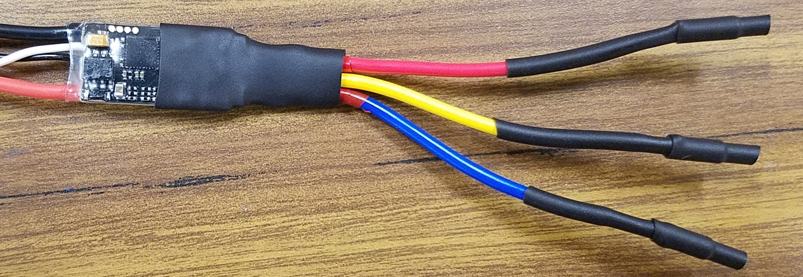
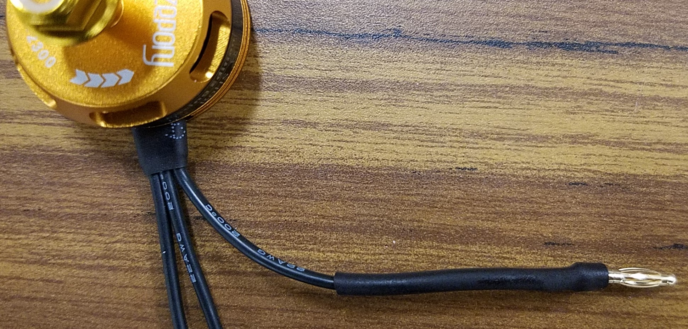
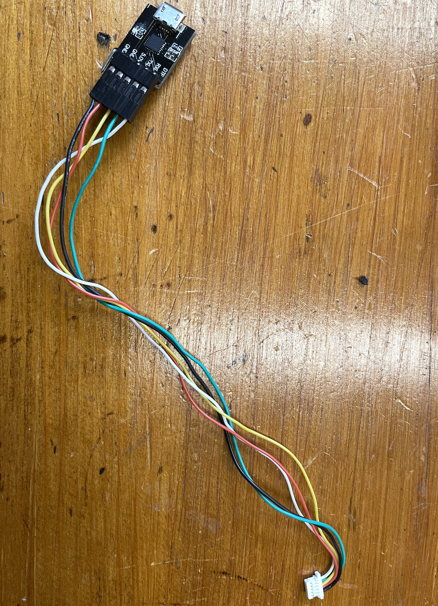
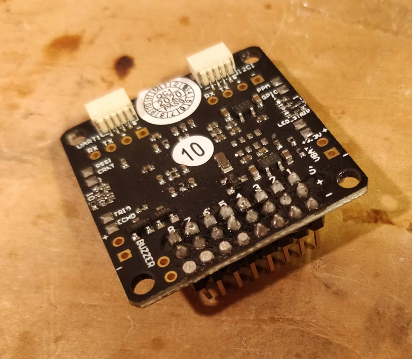
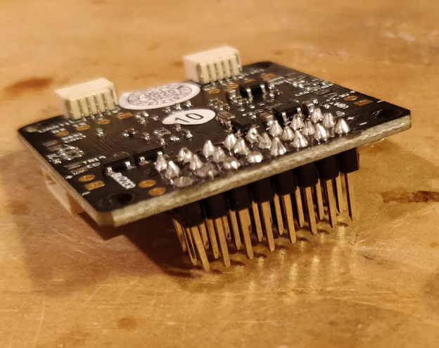
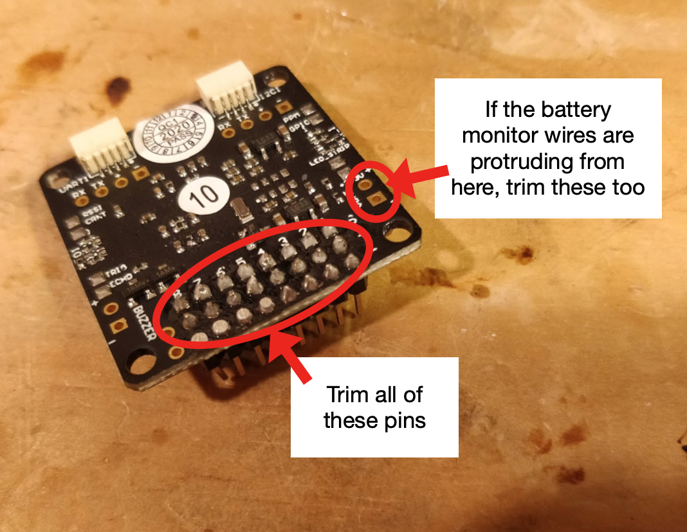
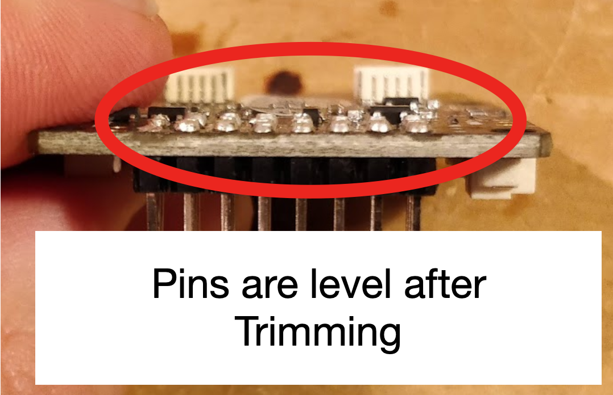
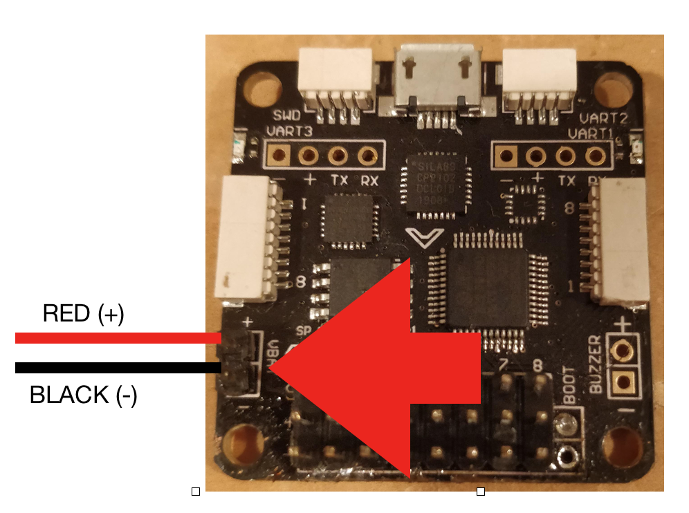

# Part 3: Motors, and ESCs Instructions {#build-part3-instructions status=ready}

**Expected Time**: 5 hours

Note: Sometimes parts will have wires already tinned out-of-the-box by the manufacturer (i.e. pre-tinned). You can identify this by: 1) the "shininess" of the tip of a wire and 2) the inability to fray the wire strands of the tip of a wire. However, such tinning is often ineffective. Cut off any pre-tinned tips, then strip and tin the part yourself.

## ESC bullet connectors

In this step you will solder bullet connectors onto the ESC wires and the motor wires so that you can easily connect them later on.

### Review soldering tutorial

Before beginning this section, please refer to a bullet connector soldering [tutorial](https://youtu.be/3oBy-jV9ajE).    

Note: You can use any setup to hold the bullet connector, so long as the setup is not thermally conductive. Also, if you have trouble soldering the bullet connectors, you may need to use a smaller soldering iron tip. Wait at least 15 minutes or longer for the soldering iron to completely cool down after unplugging before attempting to swap the soldering iron tip.

### Strip and Tin the ESC power wires

1. Strip about 5mm from the ends of the red and black wires on each ESC

1. Tin the red and black wires on each ESC

### Solder the socket bullet connectors to the ECS wires

For each ESC:

1. Solder a socket bullet connector to the end of each of the 3 blue ESC wires.

1. Put a heat shrink over each solder joint. For socket connectors: the heat shrink should cover the solder joint on one end and run the entire length of the bullet connector. Apply heat to shrink the heat shrink.
 
<figure>  
    <figcaption>Put Heat Shrinks on Socket Bullet Connectors (ignore the fact that the ESCs shown in these pictures are slightly different than those you are using)</figcaption>
    <figure>
        <figcaption>Socket Bullet Connectors on ESCs</figcaption>
        
    </figure>
    <figure>  
        <figcaption>Socket Bullet Connector with Heat Shrinks</figcaption>
        
    </figure>
</figure>  

## Motor bullet connectors

### Strip the motor wires

1. Strip about 5mm from the ends of the three black wires on each motor

### Tin the motor wires

1. Tin the ends of the three black wires on each motor

### Solder the plug bullet connectors to the motor wires

For each motor:

1. Solder a plug bullet connector to each of the motor's wires.

1. Put a heat shrink over each solder joint. For male connectors: the heat shrink should cover the solder joint on one end and run only the short length of the cylindrical part. Apply heat to shrink the heat shrink.

<figure>  
    <figcaption>Put Heat Shrinks on Plug Bullet Connectors</figcaption>
    <figure>
        <figcaption>Plug Bullet Connectors on Motor wires</figcaption>
        
    </figure>
    <figure>  
        <figcaption>Plug Bullet Connector with Heat Shrinks</figcaption>
        
    </figure>
</figure>     

Visually inspect each ESC and verify that the heat shrinks are on properly; there should be no exposed wires and each heat shrink should be a tight fit.

- Visually inspect that each of the following is stripped and tinned: 4 ESCs, 4 motors

- Do a [connectivity check](https://docs.duckietown.org/daffy/opmanual_sky/out/build_multimeter.html) on each ESC; for each ESC, verify there are no shorts between any two wires you soldered.

## Prepping the Flight Controller

### USB attachment

In order to connect the flight controller to our pi, we will use a USB cable. This particular flight controller features an externally attached USB port. We'll use this to attach USB port to the Flight controller. 

Place the pins into the holes in the USB-TTL and through hole solder. See image below for the correct wire ordering
<figure>  
    <figcaption>USB port attachment</figcaption>
    
</figure>

Now we can plug the USB-TTL into the flight controller. Make sure to plug into the port shown below

<figure>  
    <figcaption>USB port attachment</figcaption>
    
</figure>

### Solder the pins to the flight controller

Solder the short edge of the straight pins to the flight controller.

Note: Be sure that direction you solder the pins into the board is exactly as shown in the images

TODO: REPLACE ALL PICTURES BELOW W/ RELEVANT ONES OF THE NEW FLIGHT CONTROLLER

<figure class="flow-subfigures">  
    <figcaption>Solder FC Pins</figcaption>
    <figure>
        <figcaption>View 1</figcaption>
        
    </figure>
    <figure>  
        <figcaption>View 2</figcaption>
        
    </figure>
</figure>

### Trim

Trim the all of the pins on the flight controller just like the four shown in the image. This helps the flight controller sit level on the drone frame.

Note: the image shows only 4 trimmed, but you will want to trim all of the pins (updated picture coming soon).

<figure class="flow-subfigures">  
<figcaption>Trim the FC pins</figcaption>
     <figure>
           <figcaption>FC pins need trimming</figcaption>
           
     </figure>
     <figure>
           <figcaption>FC with pins cut</figcaption>
           
     </figure>
</figure>

### Solder the battery monitor leads to the flight controller

Tin and solder the battery leads to the flight controller as shown in the image

<figure>  
    <figcaption>View 2</figcaption>
    
</figure>

