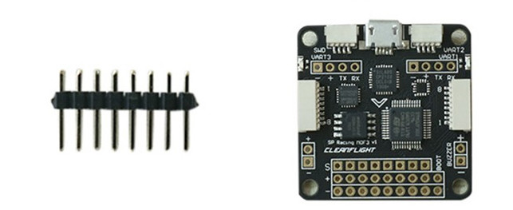

# Part 3: Flight Controller and Cleanflight  Overview {#build-part3-fc-overview status=ready}

## Preface

In this phase of the build, you will configure and calibrate the Flight Controller and ESCs. First, you will flash the flight controller with firmware, then you will configure the firmware to the settings that work best on the drone. Firmware is a special type of software that controls the hardware on a device.  

**Part : Quantity**
- Foam Mounting Tape : 1
- USB to Micro USB cable : 1
- Spare wires

## Hardware

### Flight Controller

The flight controller (i.e. FC) contains multiple sensors: an Inertial Measurement Unit (IMU) and a gyroscope. The IMU measures linear accelerations and the gyroscope measures angular velocities. The flight controller also receives commands from the Pi and them sends electric signals to the ESCs which in turn change the speeds of the motors.

<figure>
     <figcaption>Flight Controller</figcaption>
    
</figure>

### Battery Monitoring Leads (Spare red and black wires)

The battery monitor wires leads allow the flight controller to *monitor* the power traversing the PDB. This is useful because the flight controller can inform the Pi of the battery voltage. The benefit of this is that the software will prevent the battery from draining too low and permanently damaging it.

You will be using the extra red and black wire that came with the kit to make the battery monitor leads

<figure>  
  
</figure>

### USB to Micro USB cable

This cable is used for two purposes. The first use is to configure the flight controller settings in CleanFlight (introduced later); this part only needs to be done once. The second use is to send the flight commands from the Raspberry Pi to the FC. This connection allows our software on the Pi to control the motors. The Pi tells the FC what roll, pitch, yaw, and throttle values the drone should have, and then the flight controller speeds up or slows down the motors to get this values.
